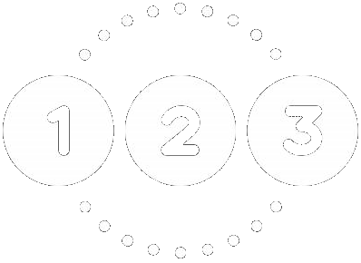

<a name="readme-top"></a>

<div align="center">

  
  <br/>

### My Enumerable
In this project you will learn how to use a module inside a class. Also you will learn how to use `yield` to run a block received by a method where it is used, returning the value of the block.

</div>

# 📗 Table of Contents

- [📨 My Enumerable](#about-project)
  - [🛠 Built With](#built-with)
    - [Tech Stack](#tech-stack)
    - [Key Features](#key-features)
- [💻 Getting Started](#getting-started)
  - [Prerequisites](#prerequisites)
  - [Setup](#setup)
  - [Run](#run)
- [👥 Authors](#authors)
- [🔭 Future Features](#future-features)
- [🤝 Contributing](#contributing)
- [⭐️ Show your support](#support)
- [🙏 Acknowledgements](#acknowledgements)
- [📝 License](#license)

<div align="center"><hr width="250px"/></div>

# 📨 My Enumerable <a name="about-project"></a>

In this project you will learn how to use a module inside a class. Also you will learn how to use `yield` to run a block received by a method where it is used, returning the value of the block.
  
## 🛠 Built With <a name="built-with"></a>

- ### Tech Stack <a name="tech-stack"></a>

  <ul>
    <li>
      <a href="https://www.ruby-lang.org/en/">
      
      Ruby
      </a>
    </li>
  </ul>

<!-- Features -->

- ### Key Features <a name="key-features"></a>

  - #### 1️⃣ Create a <kbd>class</kbd> named `MyList`.
    - It has a `@list` instance variable.
    - It implements a method called `each` that yields successive members of `@list` and uses a module named `MyEnumerable`.

  - #### 2️⃣ Create a <kbd>module</kbd> named `MyEnumerable`.
    - It implements `all?`, `any?` and `filter` methods.
    - These methods should have the same funcionality as methods in [Enumerable](https://ruby-doc.org/core-3.0.0/Enumerable.html) class.

  - #### 2️⃣ Each <kbd>class</kbd> and <kbd>module</kbd> should has a separate `.rb` file.
    - `MyEnumerable` module is used in the `MyList` class.
    - Reuse code from different files.

<p align="right">(<a href="#readme-top">back to top</a>)</p>

<!-- LIVE DEMO

## 🚀 Live Demo <a name="live-demo"></a>

> Add a link to your deployed project.

- [Live Demo Link](<replace-with-your-deployment-URL>)

<p align="right">(<a href="#readme-top">back to top</a>)</p>
-->
<!-- GETTING STARTED -->

## 💻 Getting Started <a name="getting-started"></a>

To get a local copy of this project up and running, follow these steps.

- ### Prerequisites

   - In order to run this project locally you need `git` installed. Please got to [Getting Started - Installing Git guide](https://git-scm.com/book/en/v2/Getting-Started-Installing-Git) and follow the steps described for your system to install `git`.
   - Also you must have `Ruby` installed, you can go to the [Installing Ruby](https://www.ruby-lang.org/en/documentation/installation/) documentation and follow the steps for your computer OS.

- ### Setup
    Clone this repository to your desired folder:
    ```sh
    cd my-folder
    git clone git@github.com:luigirazum/our-enumerable.git
    cd our-enumerable
    ```
- ### Run
    In the `our-enumerable` folder, use the following code to run the app
    ```rb
    ruby my_list.rb
    ```

- ### Test
    In the `irb` shell, use the following to test the code
    ```rb
    # Import MyList class
    irb> require_relative 'my_list'
    => true
    
    # Create our list
    irb> list = MyList.new(1, 2, 3, 4)
    => #<MyList: @list=[1, 2, 3, 4]>

    # Test #all?
    irb> list.all? {|e| e < 5}
    => true
    irb> list.all? {|e| e > 5}
    => false

    # Test #any?
    irb> list.any? {|e| e == 2}
    => true
    irb> list.any? {|e| e == 5}
    => false

    # Test #filter
    irb> list.filter {|e| e.even?}
    => [2, 4]
    ```

<p align="right">(<a href="#readme-top">back to top</a>)</p>

<!-- AUTHORS -->

## 👥 Author(s) <a name="authors"></a>

<details>
  <summary>

  👨‍💻 **Luis Zubia**
  </summary>

  <ul>
    <li>
        <a href="https://github.com/luigirazum">
        
        Github: <b>@luigirazum</b>
        </a>
      </li>
      <li>
        <a href="https://twitter.com/LuigiRazum">
        
        Twitter: <b>@LuigiRazum</b>
        </a>
      </li>
      <li>
        <a href="https://linkedin.com/in/luiszubia">
        
        LinkedIn: <b>Luis Zubia</b>
        </a>
      </li>
  </ul>
</details>

<br>

<details>
  <summary>

  👤 **Misal Azeem**
  </summary>

  <ul>
    <li>
        <a href="https://github.com/misalazeem">
        
        Github: <b>@misalazeem</b>
        </a>
      </li>
      <li>
        <a href="https://twitter.com/misal_azeem">
        
        Twitter: <b>@misal_azeem</b>
        </a>
      </li>
      <li>
        <a href="https://linkedin.com/in/misal-azeem/">
        
        LinkedIn: <b>Misal Azeem</b>
        </a>
      </li>
  </ul>
</details>

<p align="right">(<a href="#readme-top">back to top</a>)</p>

<!-- FUTURE FEATURES -->

## 🔭 Future Features <a name="future-features"></a>

- Add methods for more than one file.
- Use of `yield` in complex implementions.

<p align="right">(<a href="#readme-top">back to top</a>)</p>

<!-- CONTRIBUTING -->

## 🤝 Contributing <a name="contributing"></a>

Contributions, issues, typos, and feature requests are welcome!

Feel free to check the [issues page](../../issues/).

<p align="right">(<a href="#readme-top">back to top</a>)</p>

<!-- SUPPORT -->

## ⭐️ Show your support <a name="support"></a>

If you like this project, your support giving a ⭐ will be highly appreciated.

<p align="right">(<a href="#readme-top">back to top</a>)</p>

<!-- ACKNOWLEDGEMENTS -->

## 🙏 Acknowledgments <a name="acknowledgements"></a>

- We would like to thank all those people that have helped us to be good programmers.

<p align="right">(<a href="#readme-top">back to top</a>)</p>

<!-- FAQ (optional)

## ❓ FAQ <a name="faq"></a>

> Add at least 2 questions new developers would ask when they decide to use your project.

- **[Question_1]**

  - [Answer_1]

- **[Question_2]**

  - [Answer_2]

<p align="right">(<a href="#readme-top">back to top</a>)</p>
-->
<!-- LICENSE -->

## 📝 License <a name="license"></a>

This project is [MIT](./LICENSE) licensed.

<p align="right">(<a href="#readme-top">back to top</a>)</p>
